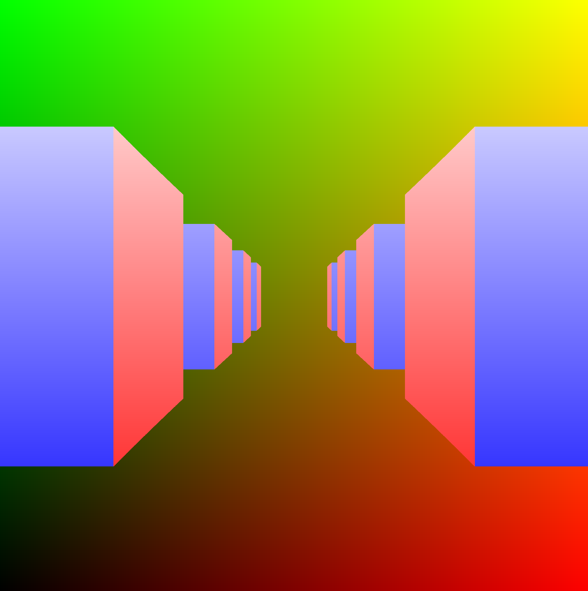

# Toycaster
Toycaster is a GPU accelerated raycaster written in Nim using
OpenGL3.2 [(EasyGL)](https://github.com/jackmott/easygl) + sdl2_nim. Instead of per pixel rendering on the CPU
side, Toycaster uses a fullscreen quad + fragment shader to render
each wall slice quickly in parallel.

# Building Instructions

1. [Install nim >= 0.17.03](https://github.com/nim-lang/Nim#compiling)
2. Clone the easygl repository
3. Run `nimble install` in the easygl repository
4. Clone toycaster repo
5. Run `nimble build` to compile toycaster
6. Run toycaster!